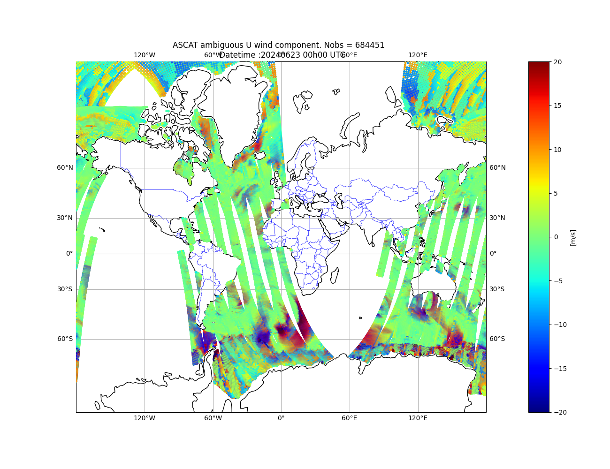

ODB data conversion 
===================
At present, odb4py provides two functions to convert ODB datasets into alternative formats, in addition to direct querying capabilities.
These conversion tools are implemented in the ``odb4py.convert`` module.

The following conversion workflows are currently supported:

Conersion from  :
   
   - ODB to ODB2 

   - ODB to NetCDF
     
   - ODB to SQLite

.. note::
   It is important to note that conversion to the ODB2 format is not handled internally by odb4py.
   Instead, users can pass the extracted data to the encoder available in the `pyodc <https://pypi.org/project/pyodc>`_  package.

Because data conversion inherently entails both read and write operations, an ODB dataset generated by the global model `ARPEGE <https://fr.wikipedia.org/wiki/Arp%C3%A8ge_(m%C3%A9t%C3%A9orologie)>`_  is used as a benchmark. This provides a representative framework for evaluating the input/output performance of the odb4py.convert module.

Conversion to ODB2
^^^^^^^^^^^^^^^^^^
The example below extracts the ASCAT *ambiguous v and u component of wind* from an ``ECMA`` ODB (``varno==124 , varno==125``) and writes the rows into an ODB2 file. 

.. code-block:: python

   #-*- coding : utf-8 -*-
   from datetime import datetime
   

   from odb4py.core import odb_open , odb_dca , odb_close 
   from pyodc       import codc 

   # Start
   start = datetime.now()

   # ODB path
   dbpath ="/path/to/ECMA.ascat"  

      # Get some needed attributes
   db        = OdbObject ( dbpath )
   db_attr   = db.get_attrib()
   db_date   = db_attr["observation_date"]  # Observation datetime

   dt = db_date.split()[0]  # Date
   tm = db_date.split()[1]  # Time

   # ODB2 output filename 
   odb2file="arpege_ascat_"+dt+"_"+tm+".odb2"

   # Set up the sql query :  Get the ambiguous U wind component  (obstype =9, codetype=139, varno=124)
   sql_query="select  statid ,   \
              degrees(lat)   ,\
              degrees(lon)   ,\
              varno          ,\
              obstype        ,\
              codetype       ,\
              date           ,\
              time           ,\
              obsvalue       ,\
              vertco_reference_1,\
              vertco_reference_2,\
              datum_status.active@body , \
              datum_status.blacklisted@body,   \
              datum_status.passive@body, \
              datum_status.rejected@body,\
              FROM hdr,body  WHERE obstype==9 AND codetype==139 AND varno ==124  ORDER BY   date,time"

   #Parse the query
   p  =SqlParser()
   nf =p.get_nfunc    ( sql_query )
   sql=p.clean_string ( sql_query )

   # Create a connection object  
   conn = odb_open( dbpath ) 

   # Fetch the rows as a dictionary 
   rows = conn.odb_dict ( database =  dbpath ,
                   sql_query= sql     ,
                   nfunc    = nf      ,
                   fmt_float= 10      ,
                   queryfile= None    ,
                   poolmask = None    ,
                   pbar     = True    )  

   # Build the dataframe   
   df = pd.dataFrame(  rows )

   # Encode into the ODB2 file                      
   encode_odb(df, odb2file ,  rows_per_frame= 1000 )
   
   # Close the odb 
   conn.odb_close()

   # End
   end = datetime.now()
   total_duration = end -  start
   print("Runtime duration:" , duration  )

Output 

.. code-block:: bash

   [##################################################] Complete 100%  (Total: 684451 rows)
   --odb4py : ODB database closed.
   Runtime duration: 0:00:12.325594

Check the output ODB2 file   
^^^^^^^^^^^^^^^^^^^^^^^^^^^

The output ODB2 file can be checked using the ECMWF  `odc <https://odc.readthedocs.io>`_ tool and visualied with `metview <https://metview.readthedocs.io/en/latest/>`_ or Python directly. 

.. code-block:: bash
   
   odc  count  ascat_arpege_20240623_000000.odb2
   684451

   odc sql -i ascat_arpege_20240623_000000.odb2 'select *  WHERE  rownumber() < 10'

   obstype@hdr	date@hdr datum_status.passive@body  codetype@hdr  time@hdr datum_status.blacklisted@body statid@hdr datum_status.active@body datum_status.rejected@body	 degrees(lat)	 degrees(lon)	obsvalue@body	  varno@body
             9	      20240622	                        0	           139	        210000	                            0	'     005'	                       1	                         0	     15.649060	   -173.493550	     -8.012632	           125
             9	      20240622	                        0	           139	        210000	                            0	'     005'	                       1	                         0	     15.649060	   -173.493550	     -2.087134	           124
             9	      20240622	                        0	           139	        210000	                            0	'     005'	                       1	                         0	     15.649060	   -173.493550	      7.754457	           125
             9	      20240622	                        0	           139	        210000	                            0	'     005'	                       1	                         0	     15.649060	   -173.493550	      1.283742	           124
             9	      20240622	                        0	           139	        210000	                            0	'     005'	                       0	                         1	     15.695730	   -173.721710	     -7.765099	           125
             9	      20240622	                        0	           139	        210000	                            0	'     005'	                       0	                         1	     15.695730	   -173.721710	     -2.197302	           124
             9	      20240622	                        0	           139	        210000	                            0	'     005'	                       0	                         1	     15.695730	   -173.721710	      7.429603	           125
             9	      20240622	                        0	           139	        210000	                            0	'     005'	                       0	                         1	     15.695730	   -173.721710	      1.552125	           124
             9	      20240622	                        0	           139	        210000	                            0	'     005'	                       0	                         1	     15.742160	   -173.949980	     -7.635057	           125

   Example : ASCAT satellite from an ARPEGE ECMA ODB converted to ODB2.

Convert ODB to NetCDF format
============================
To perform the conversion into NetCDF format the ``odb_to_nc`` function has to be called. The data encoding is handled in the backend, ensuring compatibility with the ODB internal format. The NetCDF variables are automatically created by mapping the data types returned by the ODB query to the corresponding types supported by the latter.

| The function returns **0** on success and **-1** on failure.

| The ARPEGE ``ECMA.ascat`` is used also in the following example.

.. code-block:: python

   #-*- coding : utf-8 -*-
   from datetime import datetime 

   # utils 
   from odb4py import SqlParser  

   # Import the method 
   from odb4py.convert import odb_to_nc

   # Start
   end  = datetime.now()

   # ODB path 
   dbpath ="/path/to/ECMA.ascat"  

   # Get some needed attributes 
   db        = OdbObject ( dbpath )
   db_attr   = db.get_attrib()
   db_tables = db_attr ["tables"]
   db_date   = db_attr ["observation_date"]  # Observation datatime 
   
   # NetCDF filename  
   dt = db_date.split()[0]  # Date 
   tm = db_date.split()[1]  # Time 

   # Output filename 
   ncfile  = "arpege_ascat_"+dt+"_"+tm+".nc"

   # Set up the sql query :  Get the ambigous U wind component  (obstype =9, codetype=139, varno=124)
   sql_query="select  statid ,   \
              degrees(lat)   ,\
              degrees(lon)   ,\
              varno          ,\
              obstype        ,\
              codetype       ,\
              date           ,\
              time           ,\
              obsvalue       ,\
              vertco_reference_1,\
              vertco_reference_2,\
              datum_status.active@body , \
              datum_status.blacklisted@body,   \
              datum_status.passive@body, \
              datum_status.rejected@body,\
              FROM hdr,body  WHERE obstype==9 AND codetype==139 AND varno ==124  ORDER BY date,time"

   #Parse the query
   p  =SqlParser()
   nf =p.get_nfunc    ( sql_query )
   sql=p.clean_string ( sql_query )

   # Fetch the data and convert to NetCDF
   status =odb_to_nc(database =dbpath ,      # (dtype -> str  )     ODB path 
                     sql_query=sql    ,      # (dtype -> str  )     The sql query 
                     nfunc    =nf     ,      # (dtype -> integer )  Number of functions found in the sql query 
                     outfile  =ncfile ,      # (dtype -> str )      The output NetCDF file
                     rows_per_chunk = 1000,  # (dtype -> int )      The number of written rows per chunk ( default is 5000)
                     zip_level   = 5  ,      # (dtype -> int )      Zlib compression level (1 to 9  )
                     poolmask = None  ,      # (dtype-> str  )      Poolmask 
                     queryfile= None  ,      # (dtype-> str  )      Sql query file
                     pbar     = True  ,      # (dtype -> boolean)   Show the progress bar 
                     verbose  = True  )      # (dtype -> boolean)   verbosity on/off  

   # End           
   end  = datetime.now()
   duration = end -  start
   print("Runtime duration:" , duration  )

.. code-block:: bash

   List of column names in  arpege_ascat_2024062300.nc
   Column   :  statid_hdr 
   Column   :  lat_hdr 
   Column   :  lon_hdr 
   Column   :  varno_body 
   Column   :  obstype_hdr 
   Column   :  codetype_hdr 
   Column   :  date_hdr 
   Column   :  time_hdr 
   Column   :  obsvalue_body 
   Column   :  an_depar_body 
   Column   :  vertco_reference_1_body 
   Column   :  vertco_reference_2_body 
   Column   :  datum_status_active_body 
   Column   :  datum_status_blacklisted_body 
   Column   :  datum_status_passive_body 
   Column   :  datum_status_rejected_body 
   ODB data have been written to file : arpege_ascat_2024062300.nc
   File size  : 6466010  Bytes

   Runtime duration: 0:00:03.98810

The **ncdump -h**  command show the structure, the data and metadat of encoded data.

.. code-block:: bash

   netcdf arpage_ascat_2024062300.nc {
   dimensions:
	obs = UNLIMITED ; // (85536 currently)
	strlen = 8 ;
   variables:
	char statid_hdr(obs, strlen) ;
	double lat_hdr(obs) ;
		lat_hdr:units = "degrees_north" ;
		lat_hdr:standard_name = "latitude" ;
	double lon_hdr(obs) ;
		lon_hdr:units = "degrees_east" ;
		lon_hdr:standard_name = "longitude" ;
	int64 varno_body(obs) ;
	int64 obstype_hdr(obs) ;
	int64 codetype_hdr(obs) ;
	int64 date_hdr(obs) ;
		date_hdr:Format = "YYYYMMDD" ;
	int64 time_hdr(obs) ;
		time_hdr:Format = "HHMMSS" ;
	double obsvalue_body(obs) ;
	double an_depar_body(obs) ;
	double vertco_reference_1_body(obs) ;
	double vertco_reference_2_body(obs) ;
	int64 datum_status_active_body(obs) ;
	int64 datum_status_blacklisted_body(obs) ;
	int64 datum_status_passive_body(obs) ;
	int64 datum_status_rejected_body(obs) ;

    // global attributes:
		:Title = "ODB data in NetCDF format" ;
		:NetCDF_filename = "scat_with_compress_6.nc" ;
		:Conventions = "CF-1.10" ;
		:Data_SQL_query = "select statid , lat , lon , varno , obstype , codetype , date , time , obsvalue , an_depar, vertco_reference_1, vertco_reference_2, datum_status.active@body , datum_status.blacklisted@body, datum_status.passive@body, datum_status.rejected@body, FROM hdr,body WHERE obstype==9 AND codetype==139 AND varno == 124 ORDER BY date,time " ;
		:NetCDF_library_version = "4.9.3 of Mar 14 2025 07:27:28 $" ;
		:History = "Created by: odb4py python package" ;
		:odb4py_version = "1.3.3" ;
		:Institution = "Royal Meteorological Institute of Belgium (RMI)" ;
		:Native_format = "ECMWF ODB" ;
		:featureType = "point" ;
		:File_datetime_creation = "2026-04-18 22:46:13 UTC" ;
		:ODB_analysis_datetime = "2024-06-23 00:00:00 UTC" ;
		:ODB_creation_datetime = "2024-11-04 11:24:13 UTC" ;
		:Number_of_ODB_pools = 32 ;
		:Number_of_considered_ODB_tables = 388 ;
		:ODB_software_version = 48 ;
		:ODB_major_version = 0 ;

Convert ODB to Sqlite database
==============================
The function ``odb_to_sqlite`` is needed to perform such a conversion. As in the case of NetCDF  conversion this function needs no *ODBConnection* object and all the variables and structures and datatype mapping are handled in the backend

| The function returns **0** on success and **-1** on failure.

| Example 

.. code-block:: python 

   #-*- coding : utf-8 -*-

   from datetime import datetime

   # Convert module 
   from odb4py.convert import odb_to_sqlite 

   # Start
   start = datetime.now()

   # ODB path
   dbpath ="/path/to/ECMA.ascat"

   # Set up the sql query :  Get the ambigous U wind component  (obstype =9, codetype=139, varno=124)
   sql_query="select  statid ,   \
              degrees(lat)   ,\
              degrees(lon)   ,\
              varno          ,\
              obstype        ,\
              codetype       ,\
              date           ,\
              time           ,\
              obsvalue       ,\
              vertco_reference_1,\
              vertco_reference_2,\
              datum_status.active@body , \
              datum_status.blacklisted@body,   \
              datum_status.passive@body, \
              datum_status.rejected@body,\
              FROM hdr,body  WHERE obstype==9 AND codetype==139 AND varno ==124  ORDER BY date,time"

   # Same as the previous example 
   # ...
   
   

   #  odb_to_sqlite method
   status =odb_to_sqlite (database  = dbpath   ,       
                          sql_query = sql_query,
                          outfile   = sqlite_file, 
                          table_name= "ASCAT", 
                          nfunc     = nf     , 
                          pbar      = True   , 
                          verbose   = True  )

   # End  
   end  = datetime.now()
   duration = end -  start
   print("Runtime duration:" , duration  )

.. code-block:: bash 

   Runtime duration: 0:00:01.988741

To inspect the SQLite database integrity and the extracted data ingestion, the `sqlite3 <https://sqlite.org/>`_ command-line utility has to be used. 
The following sqlite commands : 

 - Open the sqlite output database and see whether the datatypes have been correctly mapped from ODB1 to SQLite.
 - Fetch the first 10 rows from all available columns.

.. code-block:: bash

   sqlite3 arpege_ascat_2024062300.sqlite

.. code-block:: bash 

   sqlite>.fullschema 
   CREATE TABLE IF NOT EXISTS "ASCAT" (statid_hdr INTEGER, degrees_lat INTEGER, degrees_lon INTEGER, varno_body TEXT, obstype_hdr TEXT, codetype_hdr TEXT, date_hdr TEXT, time_hdr TEXT, obsvalue_body INTEGER, vertco_reference_1_body INTEGER, vertco_reference_2_body INTEGER, datum_status_active_body TEXT, datum_status_blacklisted_body TEXT, datum_status_passive_body TEXT, datum_status_rejected_body TEXT);

   sqlite>.tables
   ASCAT

   sqlite> select   *   FROM  ASCAT WHERE  degrees_lat BETWEEN 34 AND 60  AND  degrees_lon between -5 AND 15  LIMIT 10;
   3|37.3063|5.2333|124|9|139|20240622|210937|0.0320263852790326|101754.512366896||0|0|0|1
   3|37.3063|5.2333|124|9|139|20240622|210937|-0.0923374476412209|101754.512366896||0|0|0|1
   3|37.34035|5.51212|124|9|139|20240622|210937|0.542813296700668|101786.251421662||0|0|0|1
   3|37.34035|5.51212|124|9|139|20240622|210937|-0.493466633364241|101786.251421662||0|0|0|1
   3|37.37374|5.79119|124|9|139|20240622|210937|0.667882580297611|101793.058252627||0|0|0|1
   3|37.37374|5.79119|124|9|139|20240622|210937|-0.583875525852227|101793.058252627||0|0|0|1
   3|37.06644|1.85671|124|9|139|20240622|210941|-0.905055759851888|101702.331313069||0|0|0|1
   3|37.06644|1.85671|124|9|139|20240622|210941|0.707447059008582|101702.331313069||0|0|0|1
   3|37.18992|2.6865|124|9|139|20240622|210941|-0.507586435107384|101760.207672596||0|0|0|1
   3|37.18992|2.6865|124|9|139|20240622|210941|0.517408241576685|101760.207672596||0|0|0|1

.. note:: 

   By default, the ``odb_to_sqlite`` method generates a table called ``ODB``. 
   To support more dynamic workflows, the table name can be given as an argument.
   This flexibility allows users to consolidate results from multiple *ODB* queries into separate SQLite tables within a single output file.

Multiple tables in one sqlite file
===================================
Create multiple SQLite tables according to ODB *varno* column. The same ECMA is used, however the both components of ambiguous wind u,v will be written in to sqlite tables in the same SQLite file.

.. code-block:: python 

   #-*- coding : utf-8 -*-
   from datetime import datetime 

   # Import
   from odb4py.convert import  odb_to_sqlite

   # Path to ODB 
   dbpath="/path/to/ECMA.ascat"

   # Start 
   start   = datetime.now()
   # Same as the previous example
   # ...

   # The sql query
   # Note the substitution of varno in the query  '{}' !
   scat_query="select  statid ,\
           lat   ,\
           lon   ,\
           varno          ,\
           obstype        ,\
           codetype       ,\
           date           ,\
           time           ,\
           obsvalue       ,\
           an_depar,      \
           vertco_reference_1,\
           vertco_reference_2,\
           datum_status.active@body , \
           datum_status.blacklisted@body,   \
           datum_status.passive@body, \
           datum_status.rejected@body,\
           FROM hdr,body  WHERE obstype==9 AND codetype==139 AND varno == {}  ORDER BY date,time"

   # Declare the obstyses to be extracted 
   # 124  --> Ambiguous U component of wind 
   # 125  -->  ''      V      ''   
   
   # Declare the varno list  
   varno_list=["124", "125"]

   for var in  varno_list :
       """
       THE PATH TO THE ODB IS THE SAME FOR EVERY OTERATION. 
       WE DON'T NEED TO UPDATE THE VARIABLES RELATIVE TO THE PATH 
       INSIDE THE LOOP :
       IOASSIGN 
       ODB_SRCPATH_CCMA 
       ODB_DATAPATH_CCMA  
       """   

       # Change the SQL query according to varno  
       query_by_var = scat_query.format(var )  

       # Parsing the query must be updated, since the query is changing for every iteration
       nf  =p.get_nfunc    ( query_by_var )
       sql =p.clean_string ( query_by_var )

       # Table names  
       tabname="varno_"+var  

       # Convert
       re =odb_to_sqlite(database  =dbpath,
                         sql_query = sql  ,
                         nfunc     = nf   ,
                         sqlite_db = sqlite_output ,
                         table_name= tabname ,
                         pbar      = True ,
                         verbose   = True  )

       # Check if it failed 
       if re  != 0 :
          print( "Failed to convert data. ODB :" , dbpath  )
          continue 

       # End                   
       end  = datetime.now()
       duration = end -  start
       print("Runtime duration:" , duration  )

.. code-block:: bash 
   
   --odb4py : Executing query from string: select statid , lat , lon , varno , obstype , codetype , date , time , obsvalue , an_depar, vertco_reference_1, vertco_reference_2, datum_status.active@body , datum_status.blacklisted@body, datum_status.passive@body, datum_status.rejected@body, FROM hdr,body WHERE obstype==9 AND codetype==139 AND varno == 124 ORDER BY date,time 
   --odb4py : Number of requested columns : 16
    [##################################################] Complete 100%  (Total: 684451 rows)
   ODB data have been written to file : output.sqlite.sqlite
   File size  : 55656448  Bytes

   --odb4py : Executing query from string: select statid , lat , lon , varno , obstype , codetype , date , time , obsvalue , an_depar, vertco_reference_1, vertco_reference_2, datum_status.active@body , datum_status.blacklisted@body, datum_status.passive@body, datum_status.rejected@body, FROM hdr,body WHERE obstype==9 AND codetype==139 AND varno == 125 ORDER BY date,time 
   --odb4py : Number of requested columns : 16
   [##################################################] Complete 100%  (Total: 684451 rows)
   ODB data have been written to file : output.sqlite.sqlite
   File size  : 111308800  Bytes

   Runtime duration: 0:00:10.348313

A table is created for each *varno* inside the same SQLite file.

.. code-block:: bash  

   sqlite3   arpege_ascat_uv_2024010400.sqlite   .tables
   varno_124  varno_125
